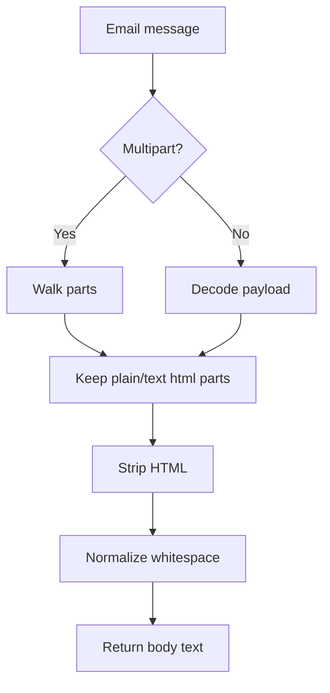
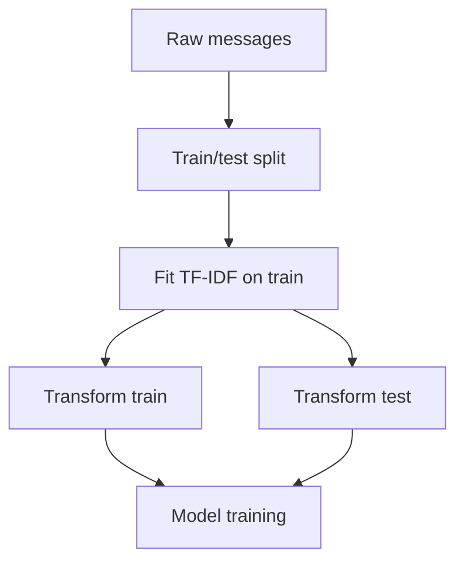
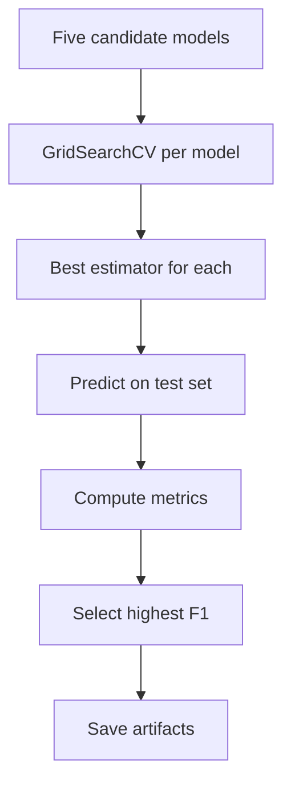

# Algorithm and Business Logic Analysis

## Algorithm 1: Email Body Extraction
**Location**: [src/utils/email_utils.py](../src/utils/email_utils.py)
**Type**: Parsing / Preprocessing
**Trigger**: When mailbox messages are loaded for batch prediction.

### Purpose
Turn MIME email structures into plain text that the classifier can consume.

### Inputs
| Parameter | Type | Range/Constraints | Source |
|-----------|------|-------------------|--------|
| msg | mailbox message | multipart or single-part email | MBOX archive |

### Outputs
| Value | Type | Meaning |
|-------|------|---------|
| clean text | string | flattened body content |

### Logic Walkthrough
1. Walk through multipart sections or decode the single payload.
2. Keep text/plain and text/html parts.
3. Strip HTML tags with BeautifulSoup.
4. Decode entities and collapse whitespace.
5. Return a trimmed plain-text string.

### Flowchart

### Complexity
- Time: O(parts + text length)
- Space: O(text length)

### Edge Cases Handled
- Multipart and non-multipart messages.
- Missing payloads.
- HTML-heavy mail.

### Weaknesses & Risks
- Aggressive normalization can remove useful formatting cues.
- Very unusual encodings may still lose content.

## Algorithm 2: Excel-Safe Text Cleaning
**Location**: [src/utils/email_utils.py](../src/utils/email_utils.py)
**Type**: Validation / Sanitization
**Trigger**: Before exporting prediction results.

### Purpose
Remove control characters and Excel-dangerous prefixes from output strings.

### Inputs
| Parameter | Type | Range/Constraints | Source |
|-----------|------|-------------------|--------|
| text | string | arbitrary user or mailbox text | message body / metadata |

### Outputs
| Value | Type | Meaning |
|-------|------|---------|
| cleaned text | string | export-safe text |

### Logic Walkthrough
1. Drop control and zero-width characters.
2. Round-trip through UTF-16 to normalize surrogate issues.
3. Truncate to 32,767 characters.
4. Prefix a quote when the string begins with a formula-like symbol.

### Complexity
- Time: O(length)
- Space: O(length)

### Edge Cases Handled
- Embedded control characters.
- Spreadsheet formula injection risk.
- Very long cells.

## Algorithm 3: TF-IDF Feature Engineering
**Location**: [src/components/data_transformation.py](../src/components/data_transformation.py)
**Type**: Feature Extraction
**Trigger**: During training after label normalization and train/test split.

### Purpose
Convert email text into sparse numeric vectors that classical ML models can consume.

### Inputs
| Parameter | Type | Range/Constraints | Source |
|-----------|------|-------------------|--------|
| X_train | series of strings | cleaned email messages | training CSV |

### Outputs
| Value | Type | Meaning |
|-------|------|---------|
| X_train_tfidf | sparse matrix | training features |
| X_test_tfidf | sparse matrix | test features |

### Logic Walkthrough
1. Lowercase text and remove English stop words.
2. Fit vocabulary on training text only.
3. Transform both train and test data.
4. Save the fitted vectorizer for inference.

### Flowchart

### Complexity
- Time: O(total tokens)
- Space: O(vocabulary size + sparse matrix)

### Weaknesses & Risks
- Vocabulary drift can hurt performance on unseen language.
- No stemming or lemmatization is used.

## Algorithm 4: Multi-Model Grid Search Selection
**Location**: [src/components/model_training.py](../src/components/model_training.py)
**Type**: Classification / Ranking
**Trigger**: For each candidate model during training.

### Purpose
Find the best spam classifier by exhaustively searching hyperparameter grids and comparing weighted F1 on held-out test data.

### Inputs
| Parameter | Type | Range/Constraints | Source |
|-----------|------|-------------------|--------|
| X_train_tfidf | sparse matrix | training features | TF-IDF output |
| y_train | array | 0 = spam, 1 = ham | label encoding |
| cv_folds | int | default 5 | pipeline argument |

### Outputs
| Value | Type | Meaning |
|-------|------|---------|
| best_model_name | string | winner by F1-score |
| best_model | estimator | fitted classifier |
| model_metrics | dict | per-model metrics |

### Logic Walkthrough
1. Instantiate Logistic Regression, Decision Tree, SVM, KNN, and Random Forest.
2. Wrap each model in `GridSearchCV` with the matching parameter grid.
3. Fit on the training set using F1 scoring.
4. Evaluate the best estimator on the test set.
5. Select the model with the highest weighted F1-score.
6. Persist artifacts and summary CSV files.

### Flowchart

### Complexity
- Time: O(models × folds × parameter combinations)
- Space: O(model artifacts + metric tables)

### Edge Cases Handled
- `zero_division=0` prevents metric crashes when a class is absent from predictions.
- `n_jobs=-1` uses all available CPU cores for search.

### Weaknesses & Risks
- Grid search can be expensive as the search space grows.
- Weighted F1 may mask minority-class behavior if the dataset remains imbalanced.

## Algorithm 5: Confidence Estimation
**Location**: [src/pipeline/prediction_pipeline.py](../src/pipeline/prediction_pipeline.py)
**Type**: Scoring / Heuristic
**Trigger**: After a prediction is produced.

### Purpose
Expose an interpretable confidence signal to the UI.

### Inputs
| Parameter | Type | Range/Constraints | Source |
|-----------|------|-------------------|--------|
| features | sparse matrix | vectorized email text | TF-IDF transformer |
| prediction | estimator output | class label | model |

### Outputs
| Value | Type | Meaning |
|-------|------|---------|
| confidence | float | percentage shown to user |
| confidence_source | string | probability or decision margin |

### Logic Walkthrough
1. Use `predict_proba` when available.
2. Otherwise use `decision_function` and convert margin magnitude to a sigmoid-like score.
3. Return `None` when neither interface exists.

### Weaknesses & Risks
- The decision-margin heuristic is not a calibrated probability.
- Confidence should be labeled carefully to avoid overclaiming certainty.
