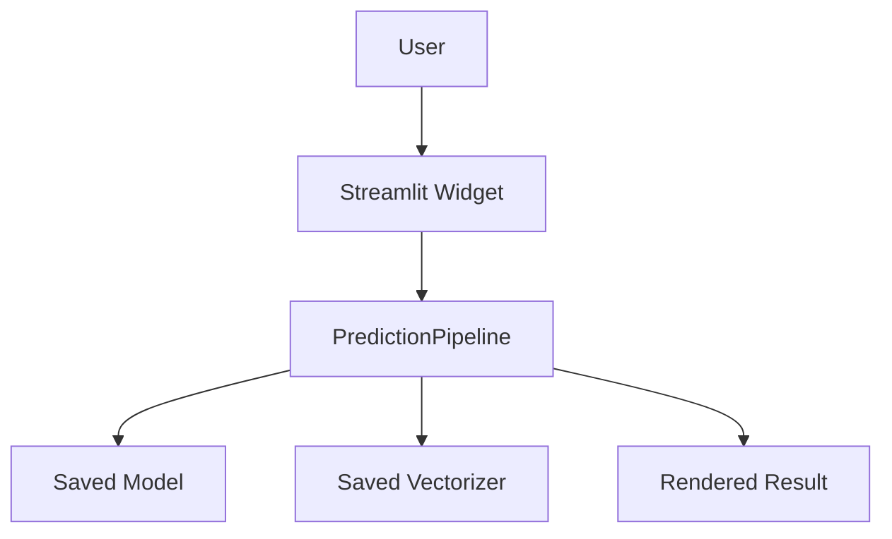

# API Guide

## Endpoint Inventory
No REST, GraphQL, WebSocket, or gRPC endpoints are implemented in the current source tree.

## Inferred Interfaces
The project exposes two user-facing interaction paths:
- Streamlit single-email classification in [app.py](../app.py).
- Streamlit batch MBOX processing in [app.py](../app.py).

## Request Flow
There is no HTTP controller layer to document. The Streamlit app calls `PredictionPipeline` methods directly inside the UI process.

## Business Logic Triggered
- `predict_single_email()` cleans the input text, vectorizes it, predicts a class, and estimates confidence.
- `predict_mbox_file()` parses mailbox messages, predicts each message, and returns a DataFrame.

## Side Effects
- Reads pickle files from `outputs/`.
- Writes temporary uploaded files to disk during MBOX processing.
- Produces downloadable CSV content in the browser.

## API Flow Diagram

## Notes
⚠️ ASSUMPTION: if this project later gains a FastAPI or Flask service, that layer should be documented here separately. The current repository does not contain one.
