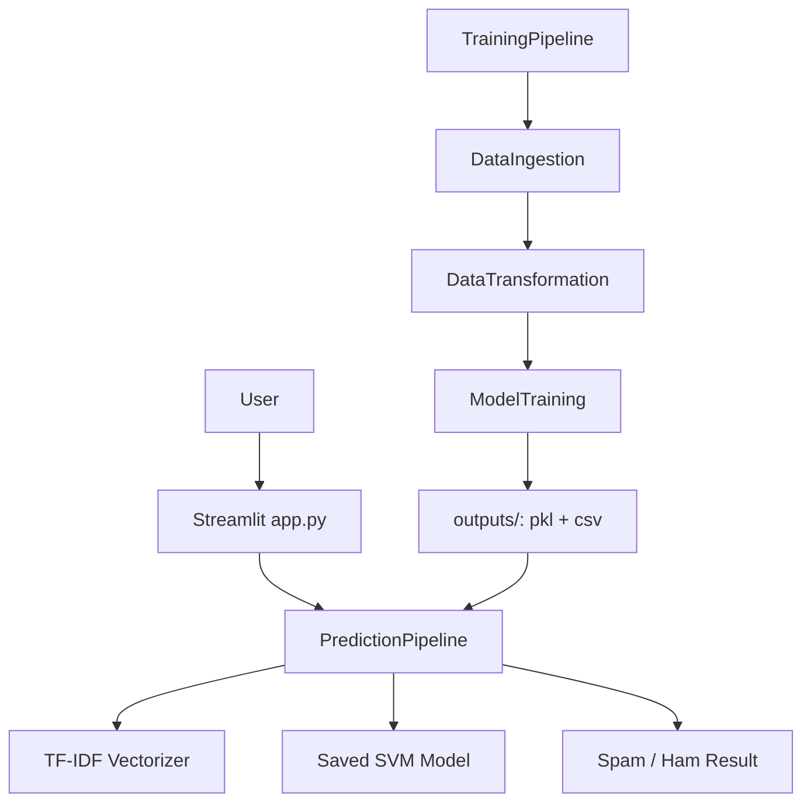
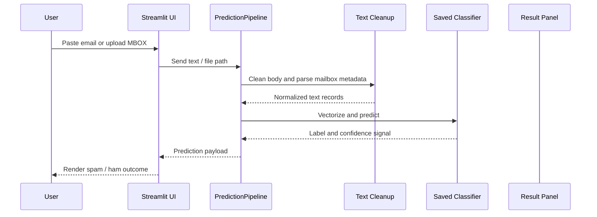
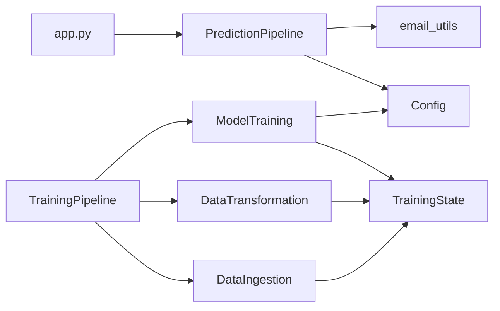
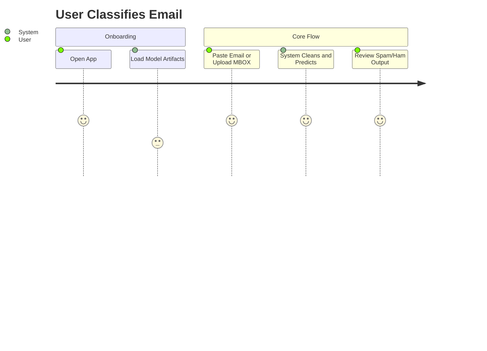
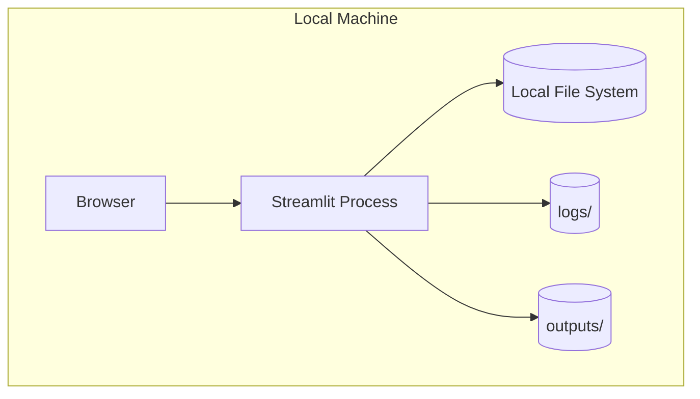

# Architecture Reconstruction

## 4.1 Architecture Layers
```text
┌─────────────────────────────────────────┐
│             CLIENT LAYER                │
│   Streamlit browser interface in app.py │
├─────────────────────────────────────────┤
│          GATEWAY / BFF LAYER            │
│      None detected; Streamlit acts      │
│      as the direct UI-to-pipeline shim  │
├─────────────────────────────────────────┤
│         APPLICATION LAYER               │
│  app.py, TrainingPipeline,              │
│  PredictionPipeline                     │
├─────────────────────────────────────────┤
│          BUSINESS LOGIC                  │
│  data cleaning, TF-IDF, model search,   │
│  confidence estimation                   │
├─────────────────────────────────────────┤
│            DATA ACCESS                   │
│  CSV ingestion, MBOX parsing, pickle    │
│  artifact loading                        │
├─────────────────────────────────────────┤
│         PERSISTENCE LAYER                │
│  data/dataset, outputs/, logs/          │
└─────────────────────────────────────────┘
```

## Architecture Summary
The project is a single-process local ML application. The UI talks directly to the inference pipeline; there is no separate API tier, database, cache, or message broker.

Training and inference are intentionally decoupled by artifacts. Training writes the vectorizer and best model to `outputs/`, and inference reads those serialized files back into memory.

## System Architecture


## Request Lifecycle Flow


## Component Dependency Graph


## User Journey Map


## Deployment Architecture


## Key Architectural Notes
- No external network service is required for inference.
- The design is artifact-driven: model files are part of the runtime contract.
- The main seam for future refactoring is separating parsing, preprocessing, and prediction into independently testable modules.
