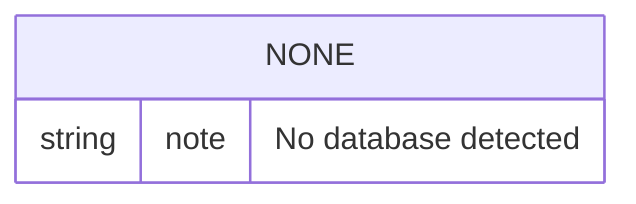

# Database Guide

## Database Inventory
No database, ORM model, migration folder, or schema definition was detected.

## Data Files Used Instead
- [data/dataset/dataset.csv](../data/dataset/dataset.csv): training source.
- [outputs/](../outputs/): generated model and metric artifacts.
- [logs/](../logs/): runtime logs.

## Table / Collection Documentation
Not applicable.

## ER Diagram

## Access Patterns
- Training reads a local CSV file.
- Inference reads local pickle files and mailbox files.
- Batch exports are written as CSV, not to a database.

## Migration Notes
No database migrations are required for the current codebase.
