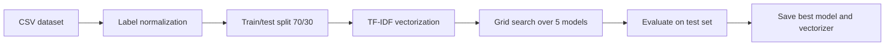
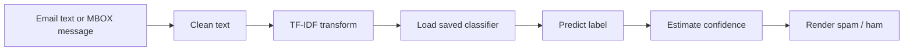

# AI / ML Analysis

## Model
**Name**: Spam Email Classifier
**Type**: Binary text classification
**Framework**: scikit-learn
**Location**: training code in [src/components/model_training.py](../src/components/model_training.py), persisted artifacts in [outputs/](../outputs/)

## Problem Statement
The model predicts whether an email message is spam or ham based on its text content.

## Dataset
| Property | Detail |
|----------|--------|
| Source | [data/dataset/dataset.csv](../data/dataset/dataset.csv) |
| Rows | 5,572 |
| Columns | 2 |
| Columns Names | `Category`, `Message` |
| Class Balance | 4,825 ham / 747 spam, so the set is imbalanced |
| Temporal Range | not explicitly modeled |

## Feature Engineering
| Feature | Type | Derivation | Importance | Risk of Leakage |
|---------|------|------------|------------|-----------------|
| Category | label | spam -> 0, ham -> 1 | target | low |
| Message text | unstructured text | raw body from CSV | primary signal | low if split before vectorization |
| TF-IDF vocabulary | sparse numeric | fit on training split only | core features | low |

## Training Pipeline

## Inference Pipeline

## Model Performance
Latest saved run in [outputs/2025-12-25_14-02-05/observations/model_comparison_summary.csv](../outputs/2025-12-25_14-02-05/observations/model_comparison_summary.csv):

| Model | Accuracy | Precision | Recall | F1 Score | CV Score | Best |
|-------|----------:|----------:|-------:|---------:|---------:|------:|
| SVM | 0.9791 | 0.9789 | 0.9791 | 0.9786 | 0.9892 | Yes |
| Logistic Regression | 0.9767 | 0.9767 | 0.9767 | 0.9759 | 0.9877 | No |
| Random Forest | 0.9707 | 0.9714 | 0.9707 | 0.9692 | 0.9879 | No |
| Decision Tree | 0.9599 | 0.9588 | 0.9599 | 0.9588 | 0.9835 | No |
| KNN | 0.9312 | 0.9363 | 0.9312 | 0.9207 | 0.9613 | No |

## Best Model Details
- Best model: SVM
- Hyperparameters: linear kernel, `C=10`, `gamma=scale`
- Persisted artifact: [outputs/2025-12-25_14-02-05/models/SVM_model.pkl](../outputs/2025-12-25_14-02-05/models/SVM_model.pkl)
- Vectorizer artifact: [outputs/2025-12-25_14-02-05/models/vectorizer.pkl](../outputs/2025-12-25_14-02-05/models/vectorizer.pkl)

## Explainability
- The model is interpretable at the feature level because TF-IDF tokens can be inspected.
- There is no SHAP or LIME implementation in the repository.
- Confidence values are exposed, but they are heuristic when a model lacks probabilistic output.

## Bias & Fairness Risks
- Spam datasets can reflect topic or region-specific vocabulary, which may create uneven performance across message styles.
- The project does not measure performance across demographic slices.
- The ham class dominates the dataset, so evaluation must continue to watch minority-class recall.

## Retraining Strategy
- Trigger: manual retraining via [src/pipeline/training_pipeline.py](../src/pipeline/training_pipeline.py).
- Monitoring: compare future run metrics to the saved baseline in `outputs/`.
- Recommended practice: retrain when vocabulary drift or user feedback indicates stale performance.
