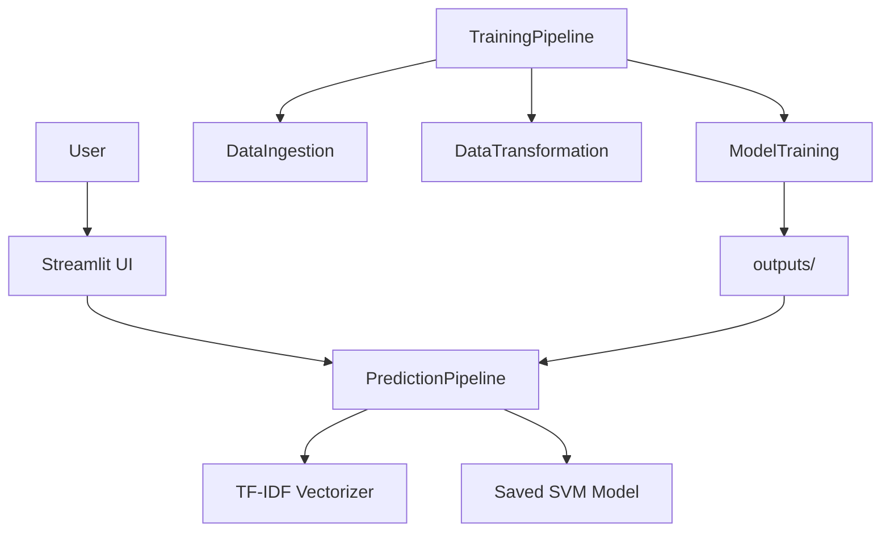

# Architecture Diagram Source

```mermaid
graph TB
  User --> Streamlit[Streamlit UI]
  Streamlit --> PredictionPipeline
  PredictionPipeline --> TFIDF[TF-IDF Vectorizer]
  PredictionPipeline --> SVM[Saved SVM Model]
  TrainingPipeline --> DataIngestion
  TrainingPipeline --> DataTransformation
  TrainingPipeline --> ModelTraining
  ModelTraining --> Outputs[outputs/]
  Outputs --> PredictionPipeline
```
