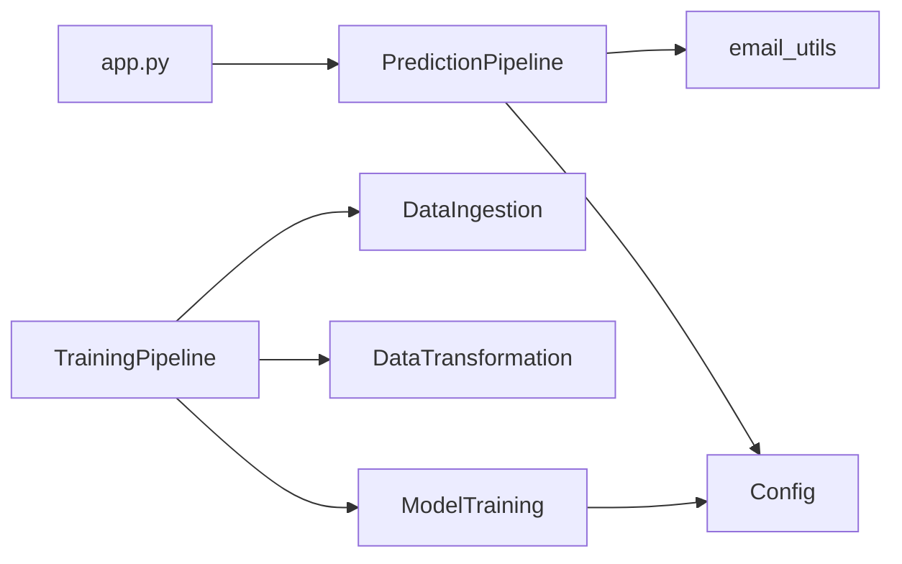

# Component Diagram Source

```mermaid
graph LR
  app[app.py] --> pp[PredictionPipeline]
  tp[TrainingPipeline] --> di[DataIngestion]
  tp --> dt[DataTransformation]
  tp --> mt[ModelTraining]
  pp --> eu[email_utils]
  pp --> cfg[Config]
  mt --> cfg
```
