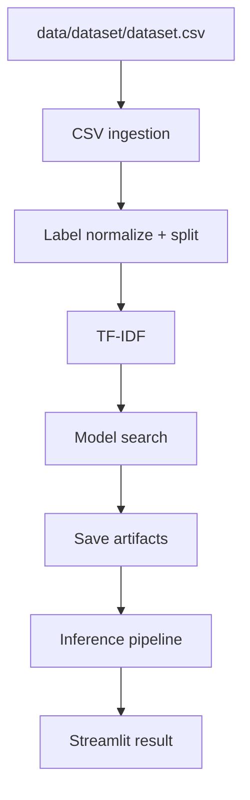

# Data Flow Diagram Source

```mermaid
flowchart TD
  CSV[data/dataset/dataset.csv] --> Ingest[CSV ingestion]
  Ingest --> Clean[Label normalize + split]
  Clean --> Vectorize[TF-IDF]
  Vectorize --> Train[Model search]
  Train --> Save[Save artifacts]
  Save --> Infer[Inference pipeline]
  Infer --> UI[Streamlit result]
```
