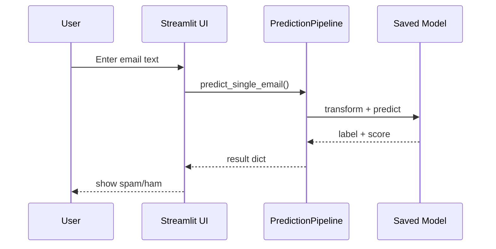

# Request Flow Diagram Source

```mermaid
sequenceDiagram
  participant User
  participant UI as Streamlit UI
  participant Pipe as PredictionPipeline
  participant Model as Saved Model
  User->>UI: Enter email text
  UI->>Pipe: predict_single_email()
  Pipe->>Model: transform + predict
  Model-->>Pipe: label + score
  Pipe-->>UI: result dict
  UI-->>User: show spam/ham
```
